# CYC Survey Platform Architecture

## Purpose

This document describes the durable architecture of the CYC Survey Platform: its major components, ownership boundaries, data model, trust boundaries, and important runtime flows. It is intended to help developers:

- Decide where new behavior belongs
- Trace requests and data across the stack
- Preserve public, student, and global-admin authorization boundaries
- Understand database relationships and Row Level Security (RLS)
- Evaluate the impact of schema, API, analytics, and deployment changes
- Recognize current constraints and known risks before refactoring

This is not a local setup guide or endpoint reference. For installation and first-contribution instructions, see [`ONBOARDING.md`](./ONBOARDING.md). For analytical decisions, see [`../ai_mem_and_context/DECISIONS.md`](../ai_mem_and_context/DECISIONS.md).

## Table of Contents

1. [Architectural Goals](#1-architectural-goals)
2. [System Context](#2-system-context)
3. [Application Components](#3-application-components)
4. [Account and Authorization Architecture](#4-account-and-authorization-architecture)
5. [Database Architecture](#5-database-architecture)
6. [API and Request Routing](#6-api-and-request-routing)
7. [Core Runtime Flows](#7-core-runtime-flows)
8. [Survey Authoring and Collaboration](#8-survey-authoring-and-collaboration)
9. [Translation Architecture](#9-translation-architecture)
10. [Analytics Architecture](#10-analytics-architecture)
11. [Referral, Raffle, and Email Architecture](#11-referral-raffle-and-email-architecture)
12. [Deployment Architecture](#12-deployment-architecture)
13. [Cross-Cutting Concerns](#13-cross-cutting-concerns)
14. [Known Constraints and Risks](#14-known-constraints-and-risks)
15. [Guidance for Architectural Changes](#15-guidance-for-architectural-changes)

---

# 1. Architectural Goals

The system is designed around these goals:

1. **Keep public survey-taking accessible.** Respondents must be able to discover active surveys and submit responses without creating a Supabase Auth account.
2. **Separate account scope from public identity.** Supabase Auth is used for allowed-domain student and global-admin accounts, not ordinary respondents.
3. **Make team ownership explicit.** Student access to surveys is derived from team membership and survey `team_id`.
4. **Provide global oversight separately.** Global administrators use `profiles.is_admin` and are not required to belong to a team.
5. **Enforce authorization server-side and in the database.** Hidden links and client filtering are usability features, not security boundaries.
6. **Preserve canonical data across languages.** Survey presentation may be localized, while stored choice answers remain stable for aggregation and analysis.
7. **Keep expensive analysis asynchronous.** Statistical jobs may outlive an HTTP request and expose progress through status artifacts and polling.
8. **Support incremental evolution.** New tables and APIs coexist with selected legacy representations during controlled transitions.

## Non-Goals

- This document does not list every component, endpoint, or database column.
- It does not replace migration files as the source of truth for the deployed schema.
- It does not define statistical methodology in full; that belongs in analytical decision records and model documentation.
- It does not make frontend route guards a substitute for API authorization or RLS.

---

# 2. System Context

## Actors and External Systems

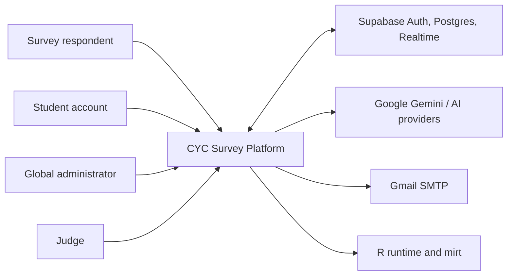

## User Surfaces

| Surface                         | User                   | Scope                                               |
| ------------------------------- | ---------------------- | --------------------------------------------------- |
| `/`, `/surveys`, `/survey/[id]` | Public respondent      | Active public surveys and respondent-owned progress |
| `/student`                      | Allowed-domain student | One team's surveys and team lifecycle               |
| `/admin`                        | Global administrator   | Cross-team surveys and global operations            |
| `/judge`                        | Judge                  | Judging-specific survey and scoring workflows       |
| `/blog`                         | Public reader          | Published posts                                     |

The `/student` and `/admin` surfaces share authentication infrastructure and selected survey tools, but they represent different authorization scopes.

---

# 3. Application Components

## Container View

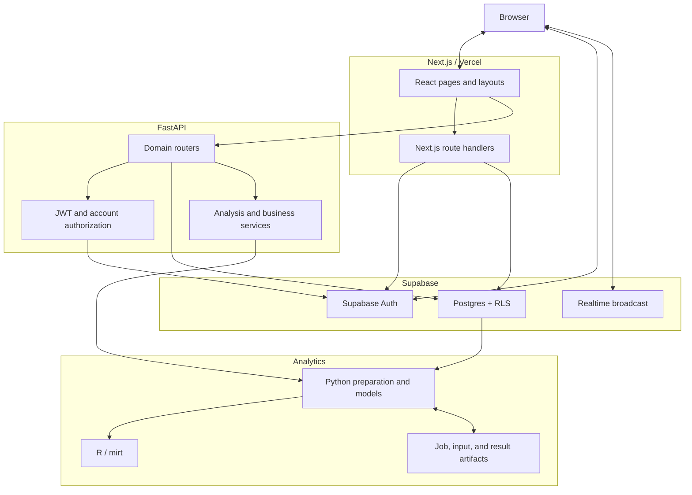

## Next.js Frontend

Primary locations:

- `src/app/`: route-level pages, layouts, and Next.js handlers
- `src/app/student/`: team-scoped student workspace
- `src/app/admin/`: global-administrator workspace
- `src/components/`: reusable UI and domain components
- `src/components/survey-tools/`: shared editor and results implementations
- `src/lib/`: Auth, Supabase, parsing, and collaboration helpers

Responsibilities:

- Render public and authenticated experiences
- Manage browser state, routing, loading, and error states
- Obtain Supabase Auth sessions
- Attach JWTs to protected requests through `adminFetch`
- Normalize localized answers before submission
- Coordinate collaborative editor state

The frontend must not make authorization decisions that the backend or database trusts. A client can be modified by its user.

## Next.js Route Handlers

Primary locations:

- `src/app/admin-api/`: signup and team lifecycle operations
- `src/app/api/admin/`: global-admin operational handlers
- `src/app/api/cron/`: scheduled reminder jobs

These handlers are used where behavior is closely coupled to Next.js, Supabase Auth, scheduled Vercel execution, or server-only environment variables.

## FastAPI Backend

Primary locations:

- `api/index.py`: application entrypoint and router registration
- `api/routes/`: HTTP endpoints by domain
- `api/dependencies.py`: Supabase client, JWT validation, account context, and survey access checks
- `api/models.py`: shared Pydantic request/response models
- `api/services/`: reusable analysis and business services

Responsibilities:

- Survey CRUD and publication state
- Response sessions and answers
- Results, summaries, referrals, and raffle pools
- Translation and AI analysis
- Statistical pipeline orchestration
- Explicit authorization before service-role data access

## Supabase

Supabase provides:

- Auth users and JWT sessions
- Postgres application storage
- RLS policies for browser/JWT access
- Database functions for atomic team operations
- Realtime broadcast channels for collaborative editing

## Analytics Runtime

The analytics subsystem combines:

- Python data extraction and transformation
- Survey-specific mapping configuration
- R-based mixed-format item response modeling
- Python Ridge/Lasso interpretation models
- Filesystem artifacts for job state, inputs, and fitted output

---

# 4. Account and Authorization Architecture

## Identity Types

### Public Respondent

- Does not require Supabase Auth
- Identified in response flows primarily by submitted email and session identifiers
- Can access active surveys and public questions
- Can create or resume response sessions through public APIs

### Student Account

- Authenticated through Supabase Auth
- Must use the configured allowed email domain
- Has `profiles.is_admin = false`
- Uses `/student`
- Belongs to at most one team
- Receives `team_member` or `team_leader` permissions

### Global Administrator

- Authenticated through Supabase Auth
- Must use the configured allowed email domain
- Has `profiles.is_admin = true`
- Uses `/admin`
- Does not require team membership
- Can act across team boundaries and perform global operations

### Judge

- Uses the separate judging authentication and scoring workflow
- Is not automatically equivalent to a student or global administrator

## Authorization Axes

Global administration and team leadership are independent:

| `profiles.is_admin` | Team role     | Effective scope                                                                       |
| ------------------- | ------------- | ------------------------------------------------------------------------------------- |
| `false`             | No membership | Student onboarding only                                                               |
| `false`             | `team_member` | View/create/edit own team's surveys                                                   |
| `false`             | `team_leader` | Member capabilities plus team administration, deletion, and sensitive team operations |
| `true`              | None or any   | Global cross-team administration                                                      |

Code must not infer global-admin status from team leadership or vice versa.

## Authentication and Routing

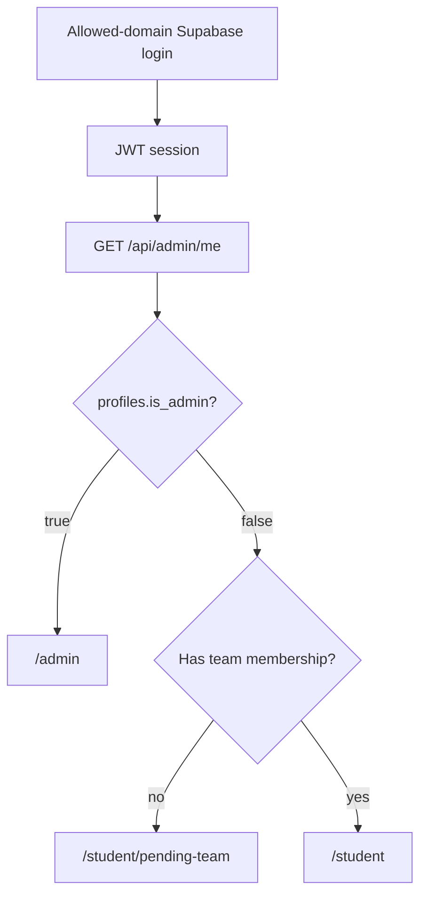

The endpoint name `/api/admin/me`, `adminFetch`, and allowed-domain environment variables retain legacy `admin` terminology even though they now support both authenticated account types.

## Backend Account Context

`api/dependencies.py` constructs an account context containing:

- Auth user ID and email
- `profiles.is_admin`
- Team membership and role

Protected endpoints should then apply one of these patterns:

1. Any valid allowed-domain account
2. Student with a team
3. Student with access to a specific survey's team
4. Student team leader
5. Global administrator only
6. Global administrator or authorized student team member

## Service-Role Boundary

The shared backend Supabase client uses a service-role key. Service role bypasses RLS. Therefore:

- JWT validation must happen before protected operations
- Account scope must be loaded from trusted data
- Survey/team authorization must happen before each scoped query or mutation
- A query filtered only by a client-provided ID is not authorization

## Privileged `is_admin` Attribute

`profiles.is_admin` controls cross-team access and must only be modified through trusted database or server operations. It must not be writable through self-service profile APIs.

> **Current security verification requirement:** The migration attempts to protect `is_admin` with column-level revokes, while an earlier migration grants authenticated users table-level `ALL` on `profiles`. PostgreSQL table-level privileges can supersede the intended column restriction. Before relying on this control in production, add a corrective migration and an integration test using a real student JWT that proves self-promotion is rejected.

---

# 5. Database Architecture

## Database Responsibilities

Postgres is the source of truth for:

- Auth-linked application profiles
- Teams, memberships, and join requests
- Surveys and questions
- Response sessions and answers
- Share links and referral attribution
- General and event raffle tickets
- Translations and blog posts
- AI analysis cache records
- Judging data and other schema represented in migrations/seed data

Migration files under `supabase/migrations/` are the canonical schema history. `db_scripts/schema.sql` and one-time scripts are legacy utilities, not the authoritative migration chain.

## Entity Relationship Diagram

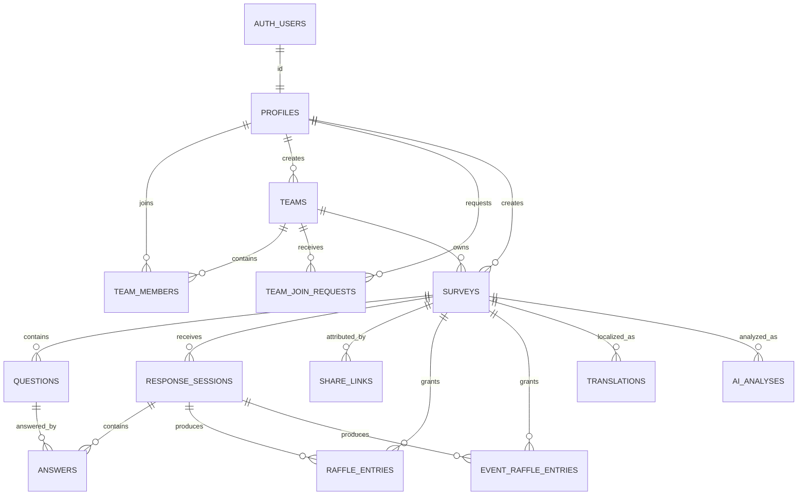

The ER diagram focuses on core platform entities. Consult migrations for complete columns, constraints, and secondary tables.

## Core Table Groups

### Accounts and Teams

| Table                | Responsibility                             | Important invariants                                    |
| -------------------- | ------------------------------------------ | ------------------------------------------------------- |
| `auth.users`         | Supabase-managed credentials and identity  | Managed by Supabase Auth                                |
| `profiles`           | Application identity and global-admin flag | `id` references `auth.users`; `is_admin` defaults false |
| `teams`              | Organizational owner of student surveys    | Creator may be recorded through `created_by`            |
| `team_members`       | Maps a profile to a team and role          | At most one team per user; one leader per team          |
| `team_join_requests` | Pending/approved/rejected team requests    | At most one pending request per user                    |

Atomic database functions implement team creation, join requests, request resolution, leaving, and leadership transfer. These functions are preferred over multi-request client transactions.

### Survey Definition

| Table          | Responsibility                                                  | Important invariants                                            |
| -------------- | --------------------------------------------------------------- | --------------------------------------------------------------- |
| `surveys`      | Survey metadata, publication state, creator, and team ownership | `team_id` determines student scope; active surveys are public   |
| `questions`    | Ordered survey questions and configuration                      | Deleted with survey; options hold structured JSON configuration |
| `translations` | Per-survey, per-language localized content                      | Unique `(survey_id, language_code)`                             |

`owner_user_id` is creator/audit metadata. It does not replace `team_id` as the student authorization boundary. Global-admin-created surveys may be unassigned (`team_id = NULL`).

### Responses

| Table               | Responsibility                           | Important invariants                                            |
| ------------------- | ---------------------------------------- | --------------------------------------------------------------- |
| `response_sessions` | Respondent progress and completion state | Associated with one survey and respondent email                 |
| `answers`           | Per-question answer values and timing    | References a session and question; unique session/question pair |

Answers support text, numeric, and structured option values. The frontend maps translated choices back to canonical values before persistence.

### Referrals and Raffles

| Table                  | Responsibility                           | Important invariants                                 |
| ---------------------- | ---------------------------------------- | ---------------------------------------------------- |
| `share_links`          | Survey-specific or global referral codes | Code is unique; global links have `survey_id = NULL` |
| `raffle_entries`       | General/referral raffle tickets          | Usually linked to survey and response session        |
| `event_raffle_entries` | Tickets scoped to an event code          | Unique event/email/survey combination                |

Raffle team scope is derived through `survey_id -> surveys.team_id`; raffle rows do not independently own a team.

### Content and Analysis

| Table         | Responsibility                                   | Important invariants              |
| ------------- | ------------------------------------------------ | --------------------------------- |
| `blog_posts`  | Public and unpublished editorial content         | Only published posts are public   |
| `ai_analyses` | Cached AI and selected legacy translation output | Keyed by survey and analysis type |

Some analytical outputs are stored as local JSON artifacts rather than database rows. See [Analytics Architecture](#10-analytics-architecture).

## Ownership Model

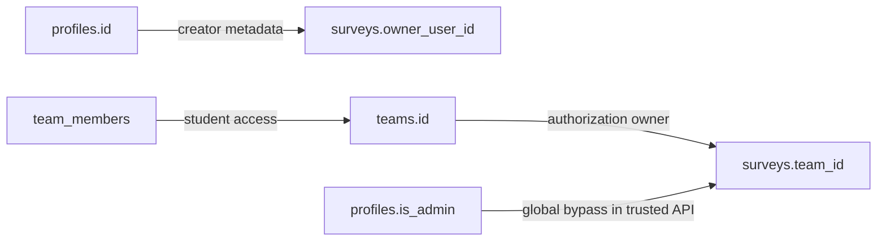

Rules:

- Students may access surveys only through membership in `surveys.team_id`.
- Team leaders gain additional operations for that team.
- Global admins are authorized by trusted backend checks and can access any survey.
- Unassigned surveys are invisible to ordinary students.
- Public users can read only active survey data allowed by public policies.

## RLS Model

RLS is enabled on core public tables. Important policy categories include:

- Anonymous read access to active surveys and their questions
- Public insertion paths needed for survey response collection
- Authenticated users reading/updating their own profile
- Students reading their own membership and team
- Team members reading/writing team surveys and questions
- Team leaders performing privileged team operations

RLS protects requests made with the anon key and user JWT. It does not constrain the service-role backend client.

### RLS Design Rule

Every new table must answer:

1. Is anonymous access required?
2. What can an authenticated student read or write?
3. Does access derive through a team-owned parent record?
4. Is a leader-only operation required?
5. Does a global admin use RLS or a trusted service-role endpoint?
6. What integration test proves cross-team denial?

## Database Functions and Atomicity

Security-definer functions currently support:

- Creating a team and its first leader membership
- Requesting team membership
- Approving/rejecting join requests
- Leaving a team
- Transferring leadership
- Checking team membership and leadership
- Restricting Auth signup by email domain

Functions that change membership use database transactions and row locking to preserve one-team and one-leader invariants under concurrent requests.

## Deletion Behavior

Important foreign-key behavior includes:

- Questions and many survey-derived records cascade when a survey is deleted
- Answers cascade when their response session or question is deleted
- Team membership and join requests cascade when a team/profile is deleted
- Some audit ownership fields use `ON DELETE SET NULL`
- Event raffle survey/session references may be set null rather than deleting historical entries

Before changing a foreign key, identify whether the child is operational state, audit history, or respondent data.

## Migration Architecture

Migrations are ordered SQL files under `supabase/migrations/`. Supabase records applied timestamps in `supabase_migrations.schema_migrations`.

Rules:

- Never edit a migration already applied to a shared environment
- Create a new migration for corrections
- Test from both an existing local database and a clean `supabase db reset`
- Use `supabase db push --linked --dry-run` before production deployment
- Never include seed data in production unless explicitly reviewed
- Reconcile migration history only after verifying the corresponding schema already exists
- Pair authorization migrations with real anon/JWT integration tests

## Seed and Generated Data

- `supabase/seed.sql` defines local seed data and is applied by local reset
- `supabase/snippets/` contains manually reviewed, environment-specific SQL
- Database dumps under local backup directories are operational artifacts, not migrations
- Generated analytics input/output files are not schema history

---

# 6. API and Request Routing

## Local Routing

In development:

- Next.js runs on port `3000`
- FastAPI runs on port `8000`
- `next.config.ts` rewrites `/api/*` requests to FastAPI
- Next.js route handlers that physically exist under `src/app/api/` or `src/app/admin-api/` execute in Next.js

## Production Routing

`vercel.json` routes general `/api/*` traffic to `api/index.py`, while cron paths remain handled by Next.js. Route ownership must be checked before adding overlapping paths.

## Endpoint Ownership

### Prefer FastAPI When

- The endpoint operates on survey, response, result, translation, referral, or analysis domains
- It reuses Python services or Pydantic models
- It invokes statistical or AI backend code
- It belongs in generated OpenAPI documentation

### Prefer a Next.js Handler When

- It is tightly coupled to Supabase Auth signup/session behavior
- It implements atomic team RPC orchestration already located under `admin-api`
- It is a Vercel cron or email operation
- It requires Next.js server runtime behavior

> **TODO(ARCHITECTURE):** Formalize one canonical rule for new endpoint ownership and eliminate ambiguous overlap between Next.js and FastAPI `/api` routes.

## Protected Request Pattern

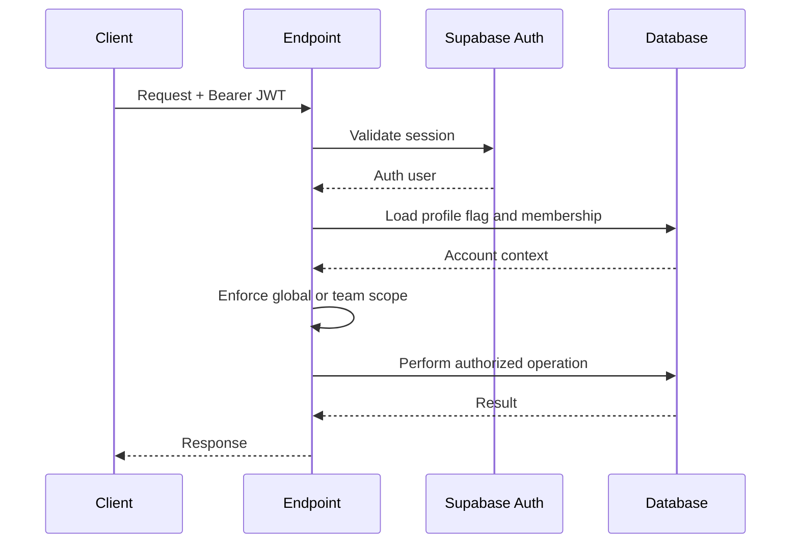

---

# 7. Core Runtime Flows

## Public Survey Completion

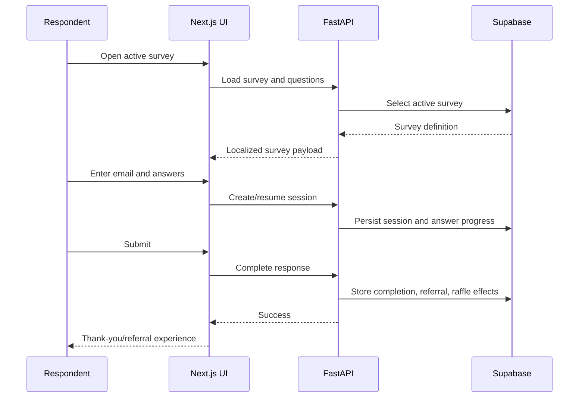

## Student Survey Management

1. Student authenticates through `/student/login`.
2. Student layout loads `/api/admin/me`.
3. Accounts with `is_admin = true` are redirected to `/admin`.
4. Unassigned students are redirected to team onboarding.
5. Team members receive survey lists filtered by their team IDs.
6. Shared editor/results components operate through `/student` route wrappers.
7. Backend survey access checks enforce team ownership.

## Global Administration

1. Administrator authenticates through `/admin/login`.
2. Admin layout requires `profiles.is_admin = true`.
3. Non-admin accounts are redirected to `/student`.
4. Global survey lists are not team-filtered.
5. Shared editor/results components operate through `/admin` wrappers.
6. Global-only endpoints use an explicit `require_admin_only` guard.

## Team Onboarding

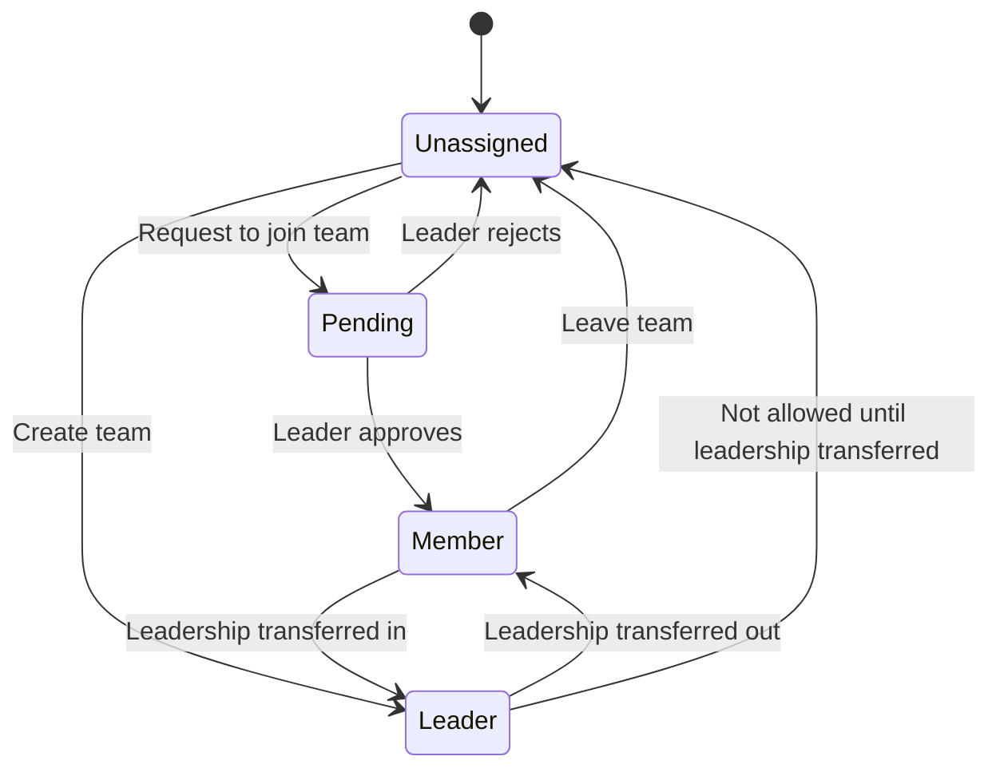

---

# 8. Survey Authoring and Collaboration

## Shared Survey Tools

The large editor and results implementations live under `src/components/survey-tools/`. Route wrappers provide a `basePath` for student and global-admin navigation:

- `/student/edit/[id]` and `/admin/edit/[id]`
- `/student/results/[id]` and `/admin/results/[id]`

Changes to shared components affect both account surfaces and must be tested in both authorization contexts.

## Survey State

Important survey fields include:

- `is_active`: controls public visibility
- `has_been_published`: records whether publication has occurred and contributes to edit locking
- `team_id`: student ownership boundary
- `owner_user_id`: creator/audit metadata
- `enabled_languages`: languages available for public presentation

Activation can permanently lock aspects of editing. Changes to publication behavior must account for public visibility, editor locking, translations, and existing responses.

## Question Configuration

Question `options` JSON stores type-specific configuration such as:

- Choices and randomization
- Maximum checkbox selections
- Definitions and descriptions
- Attachments
- Validation rules
- Conditional logic gates

Temporary question IDs may be used while authoring. The backend remaps them to database UUIDs and updates logic-gate references during creation.

## Collaborative Editing

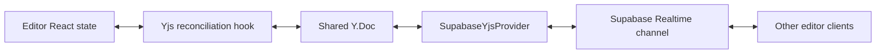

The shared Yjs document contains:

- Scalar survey metadata
- A collaborative rich-text description fragment
- A structured array of question maps
- Awareness/presence state

Yjs provides convergence; Supabase Realtime is transport, not durable document storage. The normal survey save operation remains responsible for persistence to Postgres.

---

# 9. Translation Architecture

## Data Representations

The platform is transitioning between:

1. The `translations` table, keyed by survey and language
2. Legacy translation records stored in `ai_analyses`

The backend currently contains fallback and dual-write behavior to preserve compatibility.

## Translation Flow

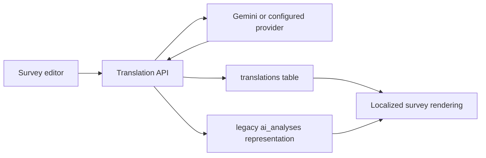

## Canonical Answer Values

Localized option labels are presentation data. Before persistence, the survey UI maps choice-based answers back to the canonical English option by index. This avoids splitting result aggregates by language.

## Change Constraints

- Preserve question ordering and IDs across languages
- Do not silently drop fallback behavior until data migration is complete
- Test all supported question types when changing translation payload shape
- Update UI locale dictionaries separately from per-survey content translations

---

# 10. Analytics Architecture

## Analytical Layers

1. **Descriptive results:** Counts, distributions, referral breakdowns, language breakdowns, and geographic summaries
2. **AI insights:** Gemini-backed modules cached through application data
3. **Latent-trait modeling:** Mixed-format item response models fitted through R
4. **Predictive interpretation:** Ridge/Lasso models explaining fitted theta values

## Latent-Trait Pipeline

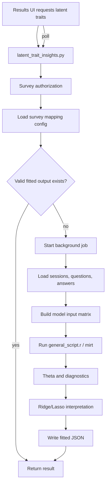

## Configuration

Survey-specific files under `api/question_topic_configs/` define which questions map to which traits. Configuration is treated as model metadata and must remain aligned with question IDs and item types.

## Artifacts

`api/latent_trait_outputs/` contains:

- `_inputs/`: generated model input rows
- `_jobs/`: job status
- top-level JSON: fitted output

These files currently act as runtime/cache artifacts. Their durability depends on the deployment filesystem and should not be assumed without explicit infrastructure support.

> **TODO(ARCHITECTURE):** Define durable job execution and artifact storage for production rather than relying on an ephemeral server filesystem.

## Modeling Invariants

- Ranking questions are excluded from the current `mirt` fit
- Non-estimable constant items are removed before fitting
- Configured trait structure controls item loading
- Predictive models explain fitted traits rather than replacing them
- Paths derived from survey IDs must validate UUIDs and remain inside the artifact directory

---

# 11. Referral, Raffle, and Email Architecture

## Referral Attribution

Share links contain a unique code and may target a survey or the global landing page. Response sessions preserve referral source so completions can be attributed and referral raffle tickets created.

## Raffle Pools

### General Raffle

- Stored in `raffle_entries`
- Includes respondent and referral tickets
- Team scope is derived through the linked survey
- Duplicate tickets intentionally affect drawing weight

### Event Raffle

- Stored separately in `event_raffle_entries`
- Scoped by `event_code`
- Gives at most one ticket per event/email/survey combination
- Used for QR-driven in-person event drawings

The wheel UI may receive a weighted list of emails. Winner history is currently browser state and is not a durable audited draw record.

## Email

Email features include:

- Scheduled reminder processing
- Manual global-admin reminder blasts

Gmail SMTP is an external side effect. A local application connected to production Gmail credentials can send real messages even when its database is local.

Architectural safeguards should include:

- Global-admin authorization for global blasts
- Explicit production/development mail configuration
- Recipient preview and count
- Strong confirmation for bulk sends
- Idempotency or send-history tracking
- Auditable failures and delivery attempts

> **TODO(ARCHITECTURE):** Replace direct production SMTP use in development with a test transport or explicit environment-level sending disablement.

---

# 12. Deployment Architecture

## Production

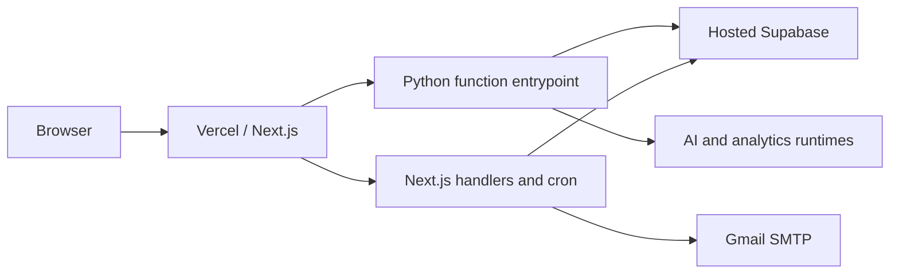

Vercel builds the Next.js app and routes most `/api/*` requests to the Python entrypoint. Scheduled reminders invoke a Next.js cron path.

## Local Development

- Next.js: port `3000`
- FastAPI: port `8000`
- Local Supabase API: commonly port `54321`
- Local Supabase database: commonly port `54322`
- Local Supabase Studio: commonly port `54323`

Docker Compose starts frontend/backend containers but does not currently start the full Supabase stack.

## Environment Separation

Application environment variables and Supabase CLI project linkage are independent:

- `.env.local` controls which services the running application uses
- `supabase link` controls which hosted project `--linked` CLI commands target

Keep application development pointed at local Supabase. Treat every `--linked` migration command as a hosted-environment operation.

## Database Deployment

Production schema changes should follow:

1. Backup or confirm recoverability
2. Verify the linked project reference
3. Compare migration history
4. Run `supabase db push --linked --dry-run`
5. Review every pending migration
6. Apply with `supabase db push --linked`
7. Configure hosted Auth hooks manually when required
8. Verify schema, RLS, application flows, and backfills

Never use `supabase db reset`, local seed scripts, or local-only snippets against production.

---

# 13. Cross-Cutting Concerns

## Security

- Validate JWTs server-side
- Enforce global or team scope before service-role queries
- Keep service-role credentials server-only
- Test RLS with actual anon/authenticated JWTs
- Treat respondent emails and raw answers as sensitive data
- Validate IDs used in filesystem paths
- Avoid logging secrets or full sensitive payloads

## Privacy

The platform stores respondent emails, answers, geographic prefixes, referral attribution, and analytical output. New features must consider:

- Collection purpose and consent
- Minimum necessary exposure
- Team/global-admin visibility
- Retention and deletion behavior
- Exports and logs
- Third-party AI processing

> **TODO(ARCHITECTURE):** Document approved retention periods, deletion workflows, and third-party data-processing constraints.

## Reliability

- External AI and SMTP calls can fail independently
- Analysis jobs can outlive request timeouts
- Filesystem artifacts may be ephemeral in serverless environments
- Client-local winner or editor state is not durable
- Multi-step database changes should use transactions or database functions

## Performance

- Supabase/PostgREST defaults can limit result counts; large reads require pagination
- Avoid loading raw response datasets into the browser unnecessarily
- Analytics queries should page/chunk large sets
- Database indexes should follow common ownership and foreign-key filters
- Large frontend route components should not duplicate editor/results implementations

## Observability

Current observability relies heavily on application logs and stored job files.

> **TODO(ARCHITECTURE):** Define structured logging, error reporting, metrics, audit events, alerting, and production ownership.

## Testing Strategy

| Layer                  | Purpose                                                        |
| ---------------------- | -------------------------------------------------------------- |
| Vitest/Testing Library | Components, layouts, and Next.js route handlers                |
| pytest unit tests      | Backend helpers, services, and isolated authorization behavior |
| Integration tests      | Real API/database/RLS contracts                                |
| Playwright             | End-to-end browser workflows                                   |

Authorization changes require more than mocked unit tests. They should include real JWT/RLS cases for anonymous, student member, student leader, global admin, and cross-team denial.

---

# 14. Known Constraints and Risks

## Current High-Priority Risks

1. **`profiles.is_admin` privilege enforcement requires correction and proof.** Column-level revokes may not neutralize earlier table-level `ALL` grants. A student self-promotion test is required.
2. **Global-admin frontend coverage is limited.** Student layout/login/dashboard tests were moved during the split; dedicated global-admin tests should be added.
3. **Analytics artifacts use local filesystem storage.** Durability and concurrency depend on deployment behavior.
4. **Bulk email can produce real external effects from local development.** Database locality does not sandbox SMTP.

## Transitional Complexity

- Translation data is dual-read/dual-written across new and legacy stores
- Auth helpers and endpoint names retain `admin` terminology while serving students too
- Next.js and FastAPI both own server endpoints
- `db_scripts/` contains legacy and potentially destructive operations alongside current migrations
- Some generated analytics artifacts are tracked in the repository

## Scalability Constraints

- Browser-based raffle pools expose/load full email ticket sets
- Some result views and analysis paths may load large datasets
- Realtime collaboration has no dedicated persistence server beyond normal saves
- Serverless execution may not suit long-running R jobs without external job infrastructure

---

# 15. Guidance for Architectural Changes

Before introducing a new component, table, endpoint, or cross-cutting feature, answer the following.

## Ownership

- Which domain owns the behavior?
- Should it live in Next.js, FastAPI, a database function, or an analysis worker?
- Can it reuse an existing shared component/service?

## Authorization

- Is it public, student-authenticated, team-member, team-leader, or global-admin scope?
- What prevents cross-team access?
- Does it use service role, user JWT/RLS, or both?
- What real integration test proves denial?

## Data

- What is the source of truth?
- Which table owns the record?
- What are the foreign-key and deletion semantics?
- Is a migration, backfill, or rollback required?
- Does the data contain personal or sensitive information?

## Runtime

- Is the work synchronous, asynchronous, scheduled, or realtime?
- Can it exceed serverless time limits?
- Does it invoke an external provider or irreversible side effect?
- How is failure observed and retried?

## Compatibility

- Does it affect public survey-taking?
- Does it change both `/student` and `/admin` shared tools?
- Does it alter translation, analytics, or historical response assumptions?
- Can old clients/data continue to function during deployment?

## Delivery Checklist

- [ ] Architecture boundary identified
- [ ] Authorization matrix documented
- [ ] Schema and RLS reviewed
- [ ] Cross-team and privilege-escalation tests added
- [ ] Public survey behavior verified
- [ ] Environment variables documented
- [ ] Migration dry-run reviewed
- [ ] External side effects guarded
- [ ] Monitoring and rollback described
- [ ] `ONBOARDING.md` and this document updated when assumptions change

---

## Maintaining This Document

Update `ARCHITECTURE.md` in the same pull request when changing:

- Account types or permission boundaries
- Route ownership between Next.js and FastAPI
- Core database relationships, RLS, or security-definer functions
- Survey publication or response lifecycle
- Translation source-of-truth behavior
- Analytics job execution or artifact storage
- Realtime collaboration transport or persistence
- Deployment topology or external providers

Implementation details will evolve. The architectural boundaries, invariants, and reasons for them should remain explicit.
