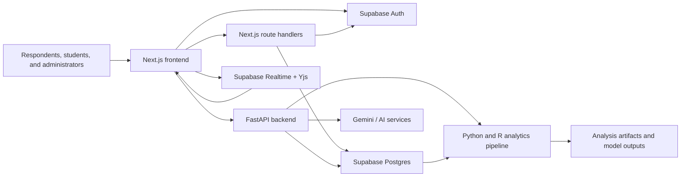
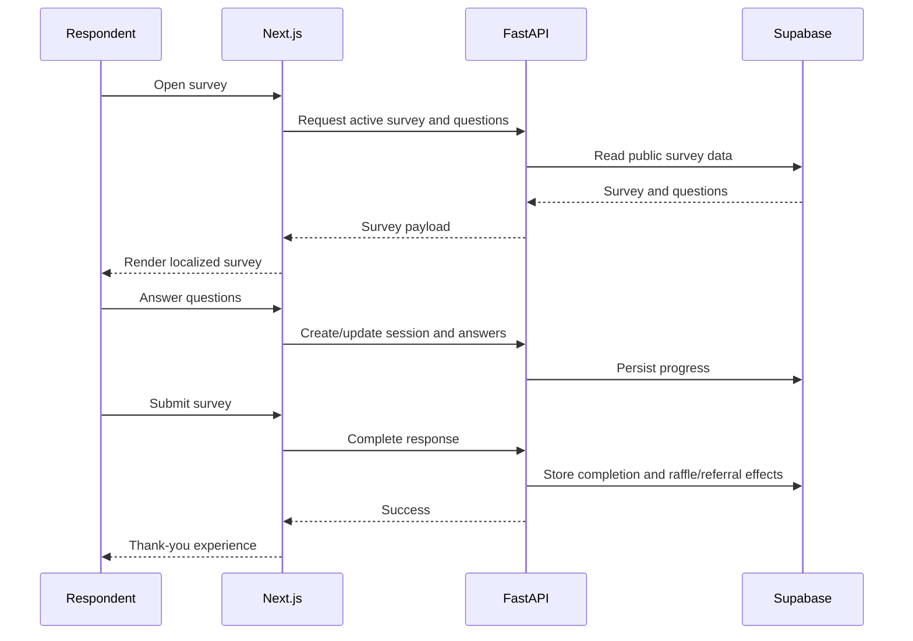
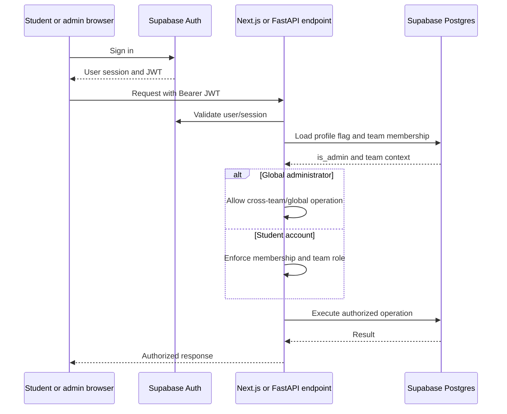
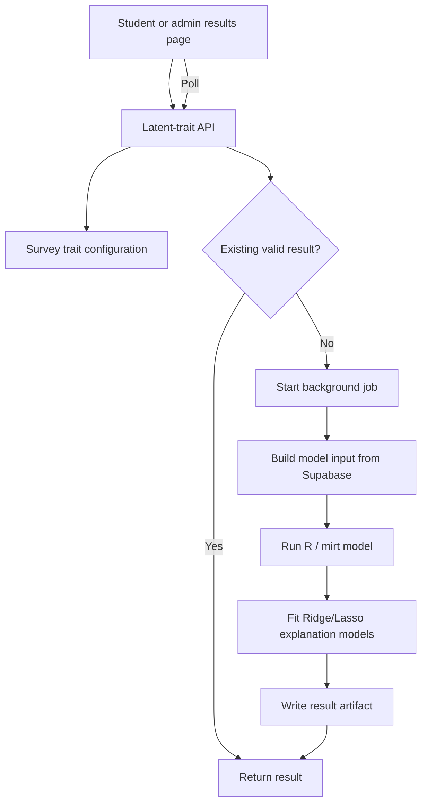

# CYC Survey Platform Developer Onboarding

Welcome to the CYC Survey Platform. This guide is intended to help a new developer clone the repository, understand the major system boundaries, run the application locally, and make a first contribution without needing to reverse-engineer the entire codebase.

> **Living document:** Update this guide whenever setup steps, architecture, deployment, or team conventions change. Search for `TODO(ONBOARDING)` to find information the team still needs to finalize.

## Table of Contents

1. [Project Overview](#1-project-overview)
2. [Repository Structure](#2-repository-structure)
3. [Local Development Setup](#3-local-development-setup)
4. [Verify Installation](#4-verify-installation)
5. [Development Workflow](#5-development-workflow)
6. [System Architecture](#6-system-architecture)
7. [Common Development Tasks](#7-common-development-tasks)
8. [Codebase Navigation Guide](#8-codebase-navigation-guide)
9. [Important Design Decisions](#9-important-design-decisions)
10. [Debugging Guide](#10-debugging-guide)
11. [Documentation Index](#11-documentation-index)
12. [First Contribution Guide](#12-first-contribution-guide)

---

# 1. Project Overview

## What the Project Does

The CYC Survey Platform is a multilingual survey application for collecting youth perspectives on Canadian policy issues. It supports:

- Public survey discovery and completion
- Resumable response sessions and conditional question logic
- Multilingual survey content
- Referral links and raffle entries
- Team-scoped student workspaces and global survey administration
- Survey response summaries and geographic analysis
- AI-assisted analysis and translation
- Statistical analysis using mixed-format item response models and predictive models
- Collaborative survey editing using Supabase Realtime and Yjs

## Users

- **Survey respondent:** Discovers surveys, submits responses, resumes sessions, and participates in referrals or raffles.
- **Student account:** Uses the `/student` workspace and belongs to at most one team. Student permissions are refined by the team roles below.
- **Student team member:** Creates, views, and edits surveys owned by their team.
- **Student team leader:** Performs member actions plus membership administration, survey deletion, leadership transfer, and access to participant-sensitive raffle operations.
- **Global administrator:** Uses `/admin`, can manage surveys across all teams, and can perform global operations such as blog administration, global links, and reminder blasts. This access requires `profiles.is_admin = true` and does not require team membership.
- **Judge:** Reviews designated surveys and submits judging scores through the separate judging interface.
- **Developer or analyst:** Maintains the application, database, translations, AI modules, and statistical pipelines.

## Why the Project Exists

The platform gives Canadian Youth Champions a reusable system for gathering structured youth input and turning responses into interpretable evidence. It combines accessible public surveys with administrative workflows and analytical tooling intended to support both rapid insight generation and reproducible statistical analysis.

## Primary Technologies

| Area                   | Technology                                                |
| ---------------------- | --------------------------------------------------------- |
| Frontend               | Next.js 16 App Router, React 19, TypeScript, Tailwind CSS |
| Backend                | FastAPI, Python 3.12+, Uvicorn                            |
| Database and Auth      | Supabase Postgres, Supabase Auth, Row Level Security      |
| Realtime collaboration | Supabase Realtime, Yjs, TipTap                            |
| Analytics              | Python, R, `mirt`, Ridge/Lasso modeling                   |
| AI                     | Google Gemini and application-specific AI services        |
| Testing                | Vitest, Testing Library, pytest, Playwright               |
| Deployment             | Vercel, Docker, Supabase                                  |

## High-Level Architecture



The browser communicates with both Next.js route handlers and the FastAPI API. Supabase provides authentication, database storage, Row Level Security, and realtime channels. The backend invokes AI and statistical pipelines when analysis is requested.

---

# 2. Repository Structure

## Major Directories

| Directory                      | Purpose                                                           | Modify it when...                                                                                                      |
| ------------------------------ | ----------------------------------------------------------------- | ---------------------------------------------------------------------------------------------------------------------- |
| `src/app/`                     | Next.js routes, pages, layouts, and Next.js API handlers          | Adding a page, changing a user workflow, modifying routing, or adding a server-side Next.js endpoint                   |
| `src/app/admin/`               | Global administrator interface                                    | Changing cross-team survey administration, blog management, global links, email blasts, or global-admin authentication |
| `src/app/student/`             | Team-scoped student interface                                     | Changing team onboarding, membership, team surveys, results, or raffles                                                |
| `src/app/admin-api/`           | Shared Next.js handlers for account and team lifecycle operations | Adding or modifying signup, team creation, membership, requests, or leadership operations                              |
| `src/components/`              | Reusable React UI and domain components                           | UI behavior is reused across pages or should be isolated from route components                                         |
| `src/components/survey-tools/` | Shared editor and results screens used by `/admin` and `/student` | Changing survey editing or results behavior common to both account surfaces                                            |
| `src/contexts/`                | Shared React contexts                                             | Adding cross-page client state such as language selection                                                              |
| `src/hooks/`                   | Reusable React hooks                                              | Encapsulating stateful behavior such as collaborative survey editing                                                   |
| `src/lib/`                     | Browser/server helpers and collaboration infrastructure           | Adding shared authentication, Supabase, parsing, or realtime logic                                                     |
| `src/config/`                  | Frontend configuration data                                       | Updating supported languages, categories, or similar controlled options                                                |
| `src/locales/`                 | UI translation dictionaries                                       | Adding or updating translated interface strings                                                                        |
| `api/`                         | FastAPI application and analytics backend                         | Adding backend behavior, data access, analysis, or shared request models                                               |
| `api/routes/`                  | FastAPI HTTP endpoints grouped by domain                          | Adding or modifying API endpoints                                                                                      |
| `api/services/`                | Reusable backend business and analysis services                   | Logic is shared, computationally substantial, or should be tested independently of HTTP                                |
| `api/utils/`                   | Focused backend utility functions                                 | Adding stateless helpers with no domain ownership elsewhere                                                            |
| `api/question_topic_configs/`  | Survey-specific analytical mappings                               | Changing question-to-trait or analysis configuration                                                                   |
| `api/latent_trait_outputs/`    | Generated analytics inputs, jobs, and result artifacts            | Debugging the statistical pipeline; treat contents as generated unless explicitly used as fixtures                     |
| `supabase/migrations/`         | Ordered database schema and RLS history                           | Making any persistent schema, constraint, function, trigger, or policy change                                          |
| `supabase/snippets/`           | Manually reviewed operational SQL                                 | Running one-time, environment-specific maintenance; never treat snippets as automatic migrations                       |
| `supabase/seed.sql`            | Local seed data applied during reset                              | Updating the canonical local development dataset                                                                       |
| `tests/unit/`                  | Fast, isolated Python tests                                       | Testing services, helpers, and route behavior without a full deployed stack                                            |
| `tests/integration/`           | Backend integration tests                                         | Testing real HTTP/database behavior against a configured test environment                                              |
| `src/**/__tests__/`            | Frontend unit and component tests                                 | Testing React components and Next.js route handlers                                                                    |
| `e2e/`                         | Playwright browser workflows                                      | Testing complete user journeys in a running application                                                                |
| `scripts/`                     | Maintenance, generation, cloning, and local tooling               | Running or adding repeatable developer operations                                                                      |
| `db_scripts/`                  | Older database utilities and one-time scripts                     | Maintaining legacy operations only after checking whether a Supabase migration supersedes them                         |
| `docs/`                        | Technical plans, specifications, and operational guides           | Recording durable system knowledge and procedures                                                                      |
| `ai_mem_and_context/`          | Project context, decisions, and work tracking for analytics       | Updating analytical architecture or its decision history                                                               |
| `public/`                      | Static browser assets                                             | Adding logos, icons, or other directly served assets                                                                   |
| `.github/`                     | CI, security analysis, and dependency automation                  | Changing repository automation or merge checks                                                                         |

## Important Root Files

| File                   | Purpose                                                 |
| ---------------------- | ------------------------------------------------------- |
| `README.md`            | Short project introduction and common setup information |
| `.env.example`         | Safe template for local environment variables           |
| `package.json`         | Frontend dependencies and npm scripts                   |
| `requirements.txt`     | Python dependencies                                     |
| `api/index.py`         | FastAPI application entrypoint and router registration  |
| `docker-compose.yml`   | Local frontend/backend containers                       |
| `supabase/config.toml` | Local Supabase service configuration                    |
| `vercel.json`          | Vercel routing and deployment configuration             |
| `vitest.config.ts`     | Frontend unit-test configuration                        |
| `playwright.config.ts` | Browser-test configuration                              |
| `pyproject.toml`       | Python tooling and pytest configuration                 |

> **Caution:** Files in `scripts/` and `db_scripts/` vary in safety. Some load `.env.local`, use service-role credentials, update rows, or delete data. Read the complete script before running it. `db_scripts/seed.py` is destructive.

---

# 3. Local Development Setup

## Prerequisites

- Git
- Node.js 22+
- npm
- Python 3.12+
- Docker Desktop or another Docker-compatible runtime
- Supabase CLI
- R and required statistical packages if working on latent-trait analysis

`TODO(ONBOARDING): Document the supported R version and the exact required R packages/install command.`

`TODO(ONBOARDING): Document whether developers should use Docker Desktop, OrbStack, Colima, or another standard team runtime.`

## Clone the Repository

```bash
git clone https://github.com/CYC-Think-Tank/CYC-Survey-Platform.git
cd CYC-Survey-Platform
```

`TODO(ONBOARDING): Confirm the canonical Git remote and whether contributors should use forks.`

## Environment Setup

Create the local environment file:

```bash
cp .env.example .env.local
```

Keep `.env.local` pointed at local services during development. Never commit it or expose the service-role key to browser code.

### Environment Variables

| Variable                                 | Required for                      | Notes                                                                    |
| ---------------------------------------- | --------------------------------- | ------------------------------------------------------------------------ |
| `NEXT_PUBLIC_SUPABASE_URL`               | Frontend                          | Local default: `http://127.0.0.1:54321`                                  |
| `NEXT_PUBLIC_SUPABASE_ANON_KEY`          | Frontend                          | Obtain from `supabase status`                                            |
| `SUPABASE_URL`                           | Backend and Next.js handlers      | Usually the same local URL                                               |
| `SUPABASE_KEY`                           | Server-side database operations   | Service-role key; never expose to browser bundles                        |
| `NEXT_PUBLIC_ALLOWED_ADMIN_EMAIL_DOMAIN` | Student/admin account UI          | Despite its legacy name, this domain check applies to both account types |
| `ALLOWED_ADMIN_EMAIL_DOMAIN`             | Server-side account authorization | Must match the public value; account access fails closed when missing    |
| `NEXT_PUBLIC_SITE_URL`                   | Links in notifications            | Use a local URL in development                                           |
| `GMAIL_USER`                             | Email features                    | Do not use production SMTP credentials for routine local development     |
| `GMAIL_APP_PASSWORD`                     | Email features                    | Omit locally unless deliberately testing real delivery                   |
| `GOOGLE_AI_KEY`                          | AI and translation features       | Optional for non-AI development                                          |
| `CRON_SECRET`                            | Reminder cron endpoint            | Required in production                                                   |

`TODO(ONBOARDING): Synchronize .env.example with every supported variable and define which values are available from the team password manager.`

## Install Dependencies

Frontend:

```bash
npm install
```

Backend:

```bash
python -m venv .venv
source .venv/bin/activate
python -m pip install --upgrade pip
pip install -r requirements.txt
```

## Start Local Supabase

```bash
supabase start
supabase status
```

Copy the local API URL, anon key, and service-role key from `supabase status` into `.env.local`.

### Initialize or Reset the Local Database

For a fresh local database:

```bash
supabase db reset
```

This recreates the **local** database, applies every file in `supabase/migrations/`, and loads `supabase/seed.sql`.

> **Never run a reset against production.** Do not use `--linked` with destructive local setup commands. Confirm that `.env.local` uses `127.0.0.1` or `localhost`.

For pending local migrations without resetting data:

```bash
supabase migration up --local
```

Restart local Supabase after Auth-hook configuration changes:

```bash
supabase stop
supabase start
```

### Create Local Student and Global-Admin Accounts

Both account types authenticate through Supabase Auth and must use the configured allowed email domain. New profiles default to student access (`is_admin = false`).

1. Sign up through `/student/login` to create a student account.
2. Assign the student to a team through the student onboarding workflow.
3. To create a global administrator, sign in once so the profile exists, then set `profiles.is_admin = true` using local Supabase Studio or trusted server-side SQL.

Example for **local Supabase only**:

```sql
update public.profiles
set is_admin = true
where email = 'developer@thecyc.org';
```

Global administrators use `/admin/login`; students use `/student/login`. Do not build browser functionality that allows a user to promote their own profile.

`TODO(ONBOARDING): Document the approved production admin-promotion and revocation process, authorized operators, and audit requirements.`

See `docs/local_supabase_clone.md` for generated local response data.

## Run the Backend

From the repository root with the Python environment activated:

```bash
uvicorn api.index:app --host 0.0.0.0 --port 8000 --reload
```

Useful URLs:

- Health check: <http://127.0.0.1:8000/health>
- OpenAPI documentation: <http://127.0.0.1:8000/docs>

## Run the Frontend

In a second terminal:

```bash
npm run dev
```

Open <http://localhost:3000>.

## Docker Alternative

```bash
docker compose up --build
```

The current Compose file starts the frontend and backend. It does **not** start Supabase; local Supabase must be running separately.

`TODO(ONBOARDING): Decide whether Docker Compose or native processes are the canonical onboarding path.`

## Optional Analytics Setup

The latent-trait pipeline invokes R scripts under `api/`. Developers working only on frontend or standard API behavior may not need R.

`TODO(ONBOARDING): Add a verified one-command analytics setup and a small fixture-based smoke test.`

## Common Setup Issues

| Symptom                                | Likely cause                                           | Recommended fix                                                                                                           |
| -------------------------------------- | ------------------------------------------------------ | ------------------------------------------------------------------------------------------------------------------------- |
| `Admin email domain is not configured` | Allowed-domain variables are missing                   | Add both allowed-domain variables and restart Next.js; the message uses legacy admin terminology but affects students too |
| `Missing Supabase access token`        | No Auth session or test mock                           | Sign in again or provide a mocked session in tests                                                                        |
| Cannot connect to port `54321`         | Local Supabase is stopped                              | Run `supabase start` and check Docker                                                                                     |
| Frontend loads but API requests fail   | FastAPI is not running or proxy configuration is wrong | Start Uvicorn and inspect `vercel.json`/Next configuration                                                                |
| `supabaseUrl is required` in tests     | Supabase variables were unavailable at module import   | Provide test-safe environment variables before importing the client                                                       |
| Missing Yjs or TipTap modules          | Node dependencies are incomplete                       | Run `npm install` and verify the lockfile is current                                                                      |
| Playwright browser executable missing  | Chromium was not installed                             | Run `npx playwright install chromium`                                                                                     |
| Analytics remains `running` or fails   | R runtime/package/config/output issue                  | Inspect API logs and files under `api/latent_trait_outputs/`                                                              |

---

# 4. Verify Installation

Use this checklist after setup:

- [ ] `supabase status` reports healthy local services.
- [ ] Supabase Studio opens at the URL reported by `supabase status` (commonly <http://127.0.0.1:54323>).
- [ ] `curl http://127.0.0.1:8000/health` returns `{"status":"ok","service":"backend"}`.
- [ ] FastAPI documentation loads at <http://127.0.0.1:8000/docs>.
- [ ] The frontend loads at <http://localhost:3000>.
- [ ] Active surveys appear on the public site.
- [ ] A seeded survey can be opened without an admin session.
- [ ] A test response can be submitted to the local database.
- [ ] `/admin` redirects a signed-out user to `/admin/login`.
- [ ] `/student` redirects a signed-out user to `/student/login`.
- [ ] An allowed-domain student account can sign in at `/student/login`.
- [ ] A student without a team reaches `/student/pending-team`.
- [ ] A student team member can see their team's surveys only.
- [ ] A profile with `is_admin = true` reaches `/admin` and can see surveys across teams.
- [ ] A global admin visiting `/student` is redirected to `/admin`.
- [ ] A student visiting `/admin` is redirected to `/student`.
- [ ] Frontend unit tests run with `npm test`.
- [ ] Python unit tests run with `pytest tests/unit -q`.
- [ ] ESLint runs with `npm run lint`.
- [ ] Ruff runs with `ruff check api/`.
- [ ] TypeScript checks with `npx tsc --noEmit`.
- [ ] Optional: Playwright runs with `npm run test:e2e`.
- [ ] Optional: a configured latent-trait survey produces or loads analysis output.
- [ ] Optional: AI analysis works with a non-production API key.

`TODO(ONBOARDING): Add non-sensitive test account fixtures and a deterministic analytics smoke-test survey.`

---

# 5. Development Workflow

## 1. Start From an Updated Branch

```bash
git switch main
git pull
git switch -c <type>/<short-description>
```

`TODO(ONBOARDING): Define the team's accepted branch prefixes, such as feat/, fix/, docs/, or chore/.`

## 2. Make a Focused Change

- Follow existing patterns in the surrounding module.
- Keep public survey-taking behavior separate from admin authorization changes.
- Add migrations for persistent schema changes; do not edit an applied migration.
- Never expose `SUPABASE_KEY` or other service credentials to client code.
- Add or update tests proportionate to the behavior being changed.

## 3. Format and Lint

```bash
npm run format:check
npm run lint
npx tsc --noEmit
ruff format --check api/ tests/
ruff check api/ tests/
```

To apply formatting:

```bash
npm run format
ruff format api/ tests/
```

## 4. Run Tests

```bash
npm test
pytest tests/unit -q
```

When relevant:

```bash
pytest tests/integration -q
npm run test:e2e
```

`TODO(ONBOARDING): Define the required local services and environment variables for integration tests.`

## 5. Review the Diff

```bash
git status
git diff --check
git diff
```

Confirm that generated files, database dumps, `.env.local`, test reports, and unrelated formatting are not included.

## 6. Commit

```bash
git add <files>
git commit -m "<type>: <concise description>"
```

`TODO(ONBOARDING): Document the team's commit-message convention and whether issue IDs are required.`

## 7. Open a Pull Request

The pull request should include:

- Problem and intended behavior
- Implementation summary
- Screenshots for visible UI changes
- Schema and environment changes
- Tests executed and their results
- Manual verification steps
- Deployment or rollback considerations

`TODO(ONBOARDING): Add the pull-request template, reviewer policy, merge strategy, and definition of done.`

---

# 6. System Architecture

## Component Responsibilities

### Next.js Frontend

- Renders public, student, global-admin, judging, and blog experiences
- Holds client-side survey state and resume behavior
- Gets Supabase Auth sessions for students and global administrators
- Attaches access tokens to protected API requests
- Hosts selected server-side route handlers for Auth, team operations, email, and cron jobs
- Reuses `SurveyEditor` and `SurveyResults` between `/student` and `/admin` through small route wrappers

### FastAPI Backend

- Implements survey CRUD, response sessions, results, referrals, translations, blogs, judging, AI insights, and analytics endpoints
- Uses shared authentication dependencies for student and global-admin requests
- Loads `profiles.is_admin` alongside team membership to determine the caller's authorization scope
- Performs team or global-admin authorization before service-role database access
- Coordinates Python and R analytical workflows

### Supabase

- Stores application data in Postgres
- Authenticates students and global administrators
- Enforces database-level RLS
- Provides Realtime channels for collaborative editing
- Runs database functions for atomic team lifecycle operations

### Analytics Pipeline

- Loads survey configuration and response data
- Produces analysis inputs
- Invokes mixed-format R modeling asynchronously
- Stores job and result artifacts
- Adds Ridge/Lasso models as an interpretation layer

## Public Survey Request Lifecycle



## Authenticated Account Request Lifecycle



## Analytics Request Lifecycle



## Trust Boundaries

- `NEXT_PUBLIC_*` variables are visible to browser code.
- The anon key is intentionally public; RLS must constrain it.
- `SUPABASE_KEY` is a service-role credential and belongs only in trusted server code.
- Public respondent endpoints must remain usable without a student or admin account.
- Authenticated endpoints must validate JWTs and then enforce either global-admin status or student team permissions server-side.
- `profiles.is_admin` is a privileged authorization attribute. It must only be changed through trusted database/server operations.
- Frontend filtering and hidden buttons are usability features, not security controls.

---

# 7. Common Development Tasks

## Adding a New API Endpoint

Typical files:

- `api/routes/<domain>.py`
- `api/models.py`
- `api/index.py` when adding a new router
- `api/dependencies.py` for shared Auth/authorization behavior
- `tests/unit/` or `tests/integration/`

Steps:

1. Choose the domain router that owns the behavior.
2. Define or reuse a Pydantic request/response model.
3. Decide whether the endpoint is public, any authenticated account, student team-scoped, team-leader-only, or global-admin-only.
4. Enforce authorization before using the service-role database client.
5. Add tests for success, missing Auth, invalid Auth, and cross-team access where applicable.
6. Verify the endpoint in FastAPI's `/docs` interface.

## Creating a New Database Table

Typical files:

- `supabase/migrations/<timestamp>_<description>.sql`
- `supabase/seed.sql` when local seed data is appropriate
- API models/routes that consume the table
- RLS and integration tests

Steps:

1. Create a new migration; never modify a migration already applied to shared environments.
2. Define primary keys, foreign keys, deletion behavior, constraints, and indexes.
3. Enable RLS and define policies for every relevant role.
4. Apply locally with `supabase migration up --local` or test from a clean `supabase db reset`.
5. Verify anon, authenticated, and service-role behavior.
6. Document deployment and any required backfill.

`TODO(ONBOARDING): Add the team's canonical migration creation command and production promotion checklist.`

## Updating the Frontend

Typical files:

- `src/app/<route>/page.tsx`
- `src/components/`
- `src/lib/`
- `src/locales/*.json`
- colocated `__tests__/`

Steps:

1. Identify whether the behavior belongs to a route or reusable component.
2. Reuse `adminFetch` for authenticated admin API calls.
3. Handle loading, empty, error, unauthorized, and mobile states.
4. Add locale strings when public UI copy changes.
5. Add component tests and verify representative desktop/mobile layouts.

## Modifying Analytics or Statistical Code

Typical files:

- `api/routes/latent_trait_insights.py`
- `api/services/ridge_lasso_service.py`
- `api/services/latent_trait_mapping_provider.py`
- `api/general_script.r`
- `api/scriptv3.r`
- `api/question_topic_configs/`
- `ai_mem_and_context/DECISIONS.md`
- analytics unit tests

Steps:

1. Identify whether the change affects data preparation, model fitting, interpretation, or display.
2. Preserve survey-ID validation and safe artifact paths.
3. Keep question metadata and model inputs aligned.
4. Confirm reproducibility and document model assumptions.
5. Use small fixtures before running full response datasets.
6. Record significant modeling decisions in the decision log.

## Adding a New Feature

Potentially involved areas:

- Frontend page/components
- FastAPI or Next.js route handler
- Supabase migration/RLS
- Tests at unit, integration, and E2E levels
- Environment and deployment configuration
- Documentation and decision log

Before implementation, answer:

- Who can use the feature?
- Is it public, student team-scoped, team-leader-only, or global-admin-only?
- What data does it read or write?
- Does RLS enforce the same rules as the API?
- Could it trigger an irreversible external side effect such as email?
- How will it be tested, deployed, monitored, and rolled back?

---

# 8. Codebase Navigation Guide

| I want to...                       | Start here                                                                                                                    |
| ---------------------------------- | ----------------------------------------------------------------------------------------------------------------------------- |
| Change the public landing page     | `src/app/page.tsx`                                                                                                            |
| Change the survey list             | `src/app/surveys/`, `api/routes/surveys.py`                                                                                   |
| Change survey-taking behavior      | `src/app/survey/[id]/page.tsx`, `api/routes/sessions.py`                                                                      |
| Add a question type                | `api/models.py`, survey editor, survey-taking page, results rendering, translations, tests                                    |
| Change the shared survey editor    | `src/components/survey-tools/SurveyEditor.tsx`, route wrappers under `src/app/admin/edit/` and `src/app/student/edit/`        |
| Change shared survey results       | `src/components/survey-tools/SurveyResults.tsx`, route wrappers under `src/app/admin/results/` and `src/app/student/results/` |
| Change global-admin authentication | `src/app/admin/login/`, `src/app/admin/layout.tsx`, `src/lib/adminAuth.ts`, `api/dependencies.py`                             |
| Change student authentication      | `src/app/student/login/`, `src/app/student/layout.tsx`, shared Auth helpers                                                   |
| Change team onboarding             | `src/app/student/pending-team/`, `src/app/admin-api/`, team migrations                                                        |
| Change account or team permissions | `api/dependencies.py`, protected routes, `profiles.is_admin`, Supabase RLS migrations                                         |
| Change AI insights                 | `src/components/AiInsightsTab.tsx`, `api/routes/ai_insights.py`, `api/services/ai_analysis.py`                                |
| Change latent-trait analysis       | `api/routes/latent_trait_insights.py`, R scripts, trait configs                                                               |
| Change translations                | `api/routes/translations.py`, `src/locales/`, `src/config/languages.ts`                                                       |
| Change referrals                   | `src/components/ReferralSection.tsx`, `api/routes/share_links.py`                                                             |
| Change raffles                     | `src/app/student/raffle/`, `api/routes/results.py`, `api/routes/sessions.py`                                                  |
| Change reminder emails             | `src/app/api/cron/reminders/route.ts`, `src/app/api/admin/notify-new-survey/route.ts`                                         |
| Change collaborative editing       | `src/hooks/useCollaborativeSurvey.ts`, `src/lib/collab/`, `src/components/collab/`                                            |
| Add a database migration           | `supabase/migrations/`                                                                                                        |
| Update local seed data             | `supabase/seed.sql`                                                                                                           |
| Add frontend tests                 | colocated `__tests__/`, `tests/setup.ts`                                                                                      |
| Add backend tests                  | `tests/unit/`, `tests/integration/`                                                                                           |
| Add browser tests                  | `e2e/`                                                                                                                        |
| Change CI                          | `.github/workflows/`                                                                                                          |
| Change deployment routing          | `vercel.json`, `next.config.ts`, Docker files                                                                                 |

---

# 9. Important Design Decisions

## Supabase Auth Supports Two Account Surfaces

Public survey respondents identify themselves through survey flows and do not create Supabase Auth accounts. Allowed-domain Auth users are routed by `profiles.is_admin`:

- `is_admin = false`: student account using `/student`, with team-scoped permissions
- `is_admin = true`: global administrator using `/admin`, with cross-team access

The email-domain rule is enforced in the UI, server-side handlers, and a Supabase Before User Created hook. The existing environment variables and some helpers retain `ADMIN` in their names even though the domain restriction now applies to both account types.

## Global Administration Is Separate From Team Leadership

`is_admin` and `team_members.role` answer different questions. A global administrator is not required to belong to a team. A student team leader controls membership and privileged operations for one team but does not gain global-admin capabilities. Do not infer one role from the other.

## Surveys Are Owned by Teams

Student team members can view, create, and edit their team's surveys. Student team leaders have additional membership, deletion, and participant-sensitive permissions. Global administrators can manage surveys across teams and may create surveys without assigning a team. `owner_user_id` records creator/audit metadata; `team_id` controls team ownership when present.

## Authorization Is Enforced Server-Side and in RLS

The UI may hide unavailable actions, but it is not a security boundary. Protected APIs validate JWTs, load `profiles.is_admin`, and enforce either global-admin status or student team roles. RLS constrains access when requests use the anon client and a user JWT. Some trusted backend operations use the service-role key and must therefore perform explicit authorization first.

## Public Survey-Taking Must Remain Independent

Student/admin Auth changes must not prevent anonymous users from loading active surveys or submitting responses. Public and authenticated access paths share tables but use different policies and endpoints.

## Survey Answers Are Canonicalized

The frontend displays localized choices but maps stored choice answers back to English/canonical option values. This keeps aggregation and analysis stable across languages.

## Translation Is in a Compatibility Transition

The `translations` table is the newer representation. Parts of the backend still read and dual-write legacy translation data in `ai_analyses`. Changes must preserve compatibility until the legacy path is deliberately removed.

## Statistical Analysis Is Asynchronous and Configuration-Driven

Latent-trait fits may exceed normal HTTP request durations. The API starts background work, writes job/result artifacts, and the frontend polls. Survey-specific mappings define modeled traits and questions.

## Predictive Models Explain Rather Than Replace MIRT

Ridge and Lasso models rank question contributions using fitted theta values. They are an interpretation layer and do not redefine the latent-trait estimates.

## Collaborative Editing Uses a CRDT

Yjs resolves concurrent edits while Supabase Realtime transports updates and awareness. The existing React editor state is reconciled with a shared Yjs document rather than replaced wholesale.

## Service-Role Credentials Are Server-Only

The service-role key bypasses RLS. It must never appear in client-visible code, public environment variables, logs, screenshots, or committed files.

## Global-Admin Promotion Is a Privileged Database Operation

New profiles default to `is_admin = false`. Promotion and revocation must happen through a trusted database or server operation, never through a self-service browser request. Any migration protecting `is_admin` must be tested using a real authenticated student JWT; comments and frontend redirects are not evidence that column-level privilege escalation is impossible.

## External Side Effects Require Extra Care

Email routes can contact real recipients even when the application is running locally. Local database configuration does not sandbox Gmail. Development environments should omit production mail credentials or use an explicit test transport.

## Additional Decisions to Document

- `TODO(ONBOARDING): Why Next.js route handlers and FastAPI coexist, and which layer should own new endpoints.`
- `TODO(ONBOARDING): Supported scale targets for surveys, responses, concurrent editors, and analysis jobs.`
- `TODO(ONBOARDING): Availability and durability expectations for filesystem-based analytics artifacts on Vercel.`
- `TODO(ONBOARDING): Staging strategy and production release approval process.`
- `TODO(ONBOARDING): Data retention, privacy, consent, and deletion requirements for respondent emails and answers.`
- `TODO(ONBOARDING): Observability standards for logs, errors, metrics, and background jobs.`
- `TODO(ONBOARDING): Add an automated RLS test proving a student JWT cannot insert or update profiles.is_admin.`

For analytics decisions already recorded, see `ai_mem_and_context/DECISIONS.md`.

---

# 10. Debugging Guide

## Frontend Problems

| Symptom                            | Likely causes                                                               | Recommended fixes                                                                                     |
| ---------------------------------- | --------------------------------------------------------------------------- | ----------------------------------------------------------------------------------------------------- |
| Blank page or compile overlay      | TypeScript/import/runtime error                                             | Read the first application frame, inspect the browser console, and run `npx tsc --noEmit`             |
| Request returns `401`              | Missing or expired Supabase session                                         | Sign in again; verify `adminFetch` attaches the token                                                 |
| Request returns `403`              | Invalid domain, missing team, wrong team role, or missing global-admin flag | Call `/api/admin/me`, inspect `is_admin` and membership, and confirm the operation's role requirement |
| Account opens the wrong workspace  | `profiles.is_admin` does not match the intended account type                | Inspect the profile flag; students belong under `/student`, global admins under `/admin`              |
| Student/admin redirects repeatedly | Auth routing race, stale session, or profile lookup failure                 | Clear the local Supabase Auth session, sign in again, and inspect the corresponding route layout      |
| Local UI differs from production   | Different code deployment or environment variables                          | Compare commit SHA and deployment environment configuration; restart local Next.js after env changes  |

## Backend Problems

| Symptom                                        | Likely causes                                       | Recommended fixes                                                          |
| ---------------------------------------------- | --------------------------------------------------- | -------------------------------------------------------------------------- |
| FastAPI is unreachable                         | Uvicorn stopped or wrong port                       | Start Uvicorn and test `/health` directly                                  |
| `500 Missing environment variables`            | Backend env is incomplete                           | Compare `.env.local` with README and `.env.example`                        |
| Supabase request fails                         | Wrong URL/key, stopped local stack, schema mismatch | Run `supabase status`, verify keys, and inspect migration status           |
| Endpoint works publicly but not when signed in | Missing JWT or account-scope authorization mismatch | Inspect request headers, `is_admin`, membership, and `api/dependencies.py` |
| Endpoint returns unexpected response shape     | Frontend/backend contract drift                     | Inspect FastAPI `/docs`, route model, and frontend parser                  |

## Database Problems

| Symptom                        | Likely causes                                       | Recommended fixes                                                                          |
| ------------------------------ | --------------------------------------------------- | ------------------------------------------------------------------------------------------ |
| Migration already-exists error | Remote schema and migration history are out of sync | Stop; compare `supabase migration list --linked` and reconcile only after verifying schema |
| RLS returns no rows            | Policy, JWT, team assignment, or null `team_id`     | Test with the correct JWT and inspect ownership/membership records                         |
| Local schema seems stale       | Migrations not applied or services not restarted    | Run `supabase migration up --local`; restart after Auth configuration changes              |
| Seed reset removed local work  | `supabase db reset` recreates local data            | Restore from a local backup or reseed; never use reset for data you need to preserve       |

## Test Problems

| Symptom                                    | Likely causes                                           | Recommended fixes                                                     |
| ------------------------------------------ | ------------------------------------------------------- | --------------------------------------------------------------------- |
| Supabase client fails during import        | Test env vars initialized too late                      | Configure them in the test setup before importing application modules |
| Mocked fetch test falls into an Auth error | `adminFetch` now requests a Supabase session            | Mock `supabase.auth.getSession` or `adminFetch` consistently          |
| Playwright cannot launch                   | Browser binary missing                                  | Run `npx playwright install chromium`                                 |
| Integration tests cannot connect           | Required frontend/backend/database services are stopped | Start the documented test stack and verify base URLs                  |

## Analytics Problems

| Symptom               | Likely causes                                             | Recommended fixes                                                                                             |
| --------------------- | --------------------------------------------------------- | ------------------------------------------------------------------------------------------------------------- |
| Job remains `running` | Worker process failed or status artifact is stale         | Inspect backend logs and `_jobs` artifacts                                                                    |
| R script fails        | Missing R/package, malformed input, or non-estimable item | Run the generated input directly and inspect excluded-item logs                                               |
| No config found       | Survey ID lacks a matching topic config                   | Add or correct a config under `api/question_topic_configs/`                                                   |
| Result appears stale  | Existing artifact is being reused                         | Follow the cache invalidation path in `latent_trait_insights.py`; do not delete production artifacts casually |

`TODO(ONBOARDING): Add logging locations, error-reporting tools, production dashboards, and escalation contacts.`

---

# 11. Documentation Index

| Document                              | Purpose                                                                     | Status                 |
| ------------------------------------- | --------------------------------------------------------------------------- | ---------------------- |
| `README.md`                           | Short project overview, environment variables, and basic setup              | Existing; keep concise |
| `ONBOARDING/ONBOARDING.md`            | Comprehensive developer onboarding and navigation                           | This document          |
| `docs/local_supabase_clone.md`        | Create a safe local clone and generated responses                           | Existing               |
| `ai_mem_and_context/PROJECT.md`       | Analytics project brief and modeling goals                                  | Existing               |
| `ai_mem_and_context/DECISIONS.md`     | Analytics architectural decision log                                        | Existing               |
| `ai_mem_and_context/TASKS.md`         | Analytics-oriented work tracking                                            | Existing               |
| `api/question_metadata.md`            | Question metadata used by analysis                                          | Existing               |
| `docs/superpowers/specs/`             | Historical feature/system specifications                                    | Existing               |
| `docs/superpowers/plans/`             | Historical implementation plans                                             | Existing               |
| `ONBOARDING/ARCHITECTURE.md`          | Application components, trust boundaries, database model, and runtime flows | Existing               |
| `DECISIONS.md`                        | `TODO(ONBOARDING): Application-wide ADR index beyond analytics`             | Missing                |
| `ONBOARDING/TESTING.md`               | Test layers, fixtures, environments, CI, and commands                       | Existing               |
| `ONBOARDING/CONTRIBUTING.md`          | Branch, commit, PR, review, and release workflow                            | Existing               |
| `ONBOARDING/SECURITY.md`              | Credential handling, reporting, Auth/RLS, and privacy                       | Existing               |
| `ONBOARDING/production-operations.md` | Backups, migrations, deployment, rollback, and incidents                    | Existing               |
| `scripts/scripts_README.md`           | Safety and intended environment for operational scripts                     | Existing               |

When adding documentation, link it here and from the closest relevant code or README section.

---

# 12. First Contribution Guide

The goal of the first contribution is to learn the system's shape, not to solve a large architectural problem.

## Suggested First Day

### 1. Set Up the Repository

- Clone the repository.
- Install frontend and backend dependencies.
- Start local Supabase.
- Reset and seed the local database.
- Start FastAPI and Next.js.
- Complete the verification checklist above.

### 2. Explore the Application

- Open the public landing page and survey list.
- Complete a short local survey response.
- Inspect the resulting rows in local Supabase Studio.
- Sign in with a local allowed-domain student account.
- Explore student team onboarding, the dashboard, survey editor, and results page.
- Promote a separate local profile to global admin and compare the `/admin` cross-team experience.

### 3. Trace One Request Through the Stack

Suggested example: loading the survey list.

1. Find the frontend request in `src/app/page.tsx` or `src/app/surveys/page.tsx`.
2. Locate the route in `api/routes/surveys.py`.
3. Follow the Supabase query to the `surveys` table.
4. Read the relevant RLS policy in the migrations.
5. Find the unit, integration, or component tests for that behavior.

Alternative traces:

- Student login through Supabase Auth, `profiles.is_admin`, and student layout routing
- Global-admin login and cross-team authorization
- Survey response submission through sessions and answers
- Team creation through a Next.js route handler and database RPC
- Latent-trait analysis from results UI to background artifact

### 4. Make a Small Change

Good first contributions include:

- Correcting or expanding documentation
- Adding a missing unit test for an existing behavior
- Improving a clear error message
- Fixing a small accessibility issue
- Removing an obsolete comment after confirming behavior

Avoid using the first contribution for production migrations, Auth policy changes, destructive scripts, bulk email behavior, or major analytics changes.

### 5. Validate the Change

Run the narrowest relevant tests, followed by the standard checks:

```bash
npm run lint
npx tsc --noEmit
npm test
ruff check api/ tests/
pytest tests/unit -q
git diff --check
```

### 6. Submit a Pull Request

- Explain what changed and why.
- Include test results.
- Add screenshots when behavior is visible.
- Call out environment, database, or deployment implications.
- Request review from the appropriate code owner.

`TODO(ONBOARDING): Add recommended starter issues, reviewer names/teams, and expected review turnaround.`

---

## Keeping This Guide Current

When a contribution changes any of the following, update this guide or its linked documentation in the same pull request:

- Required tools or versions
- Environment variables
- Startup commands or ports
- Authentication or role behavior
- Database migration workflow
- Test commands or CI requirements
- Deployment architecture
- Analytics setup
- Repository directory ownership

The best onboarding guide is one that developers can trust enough to follow without a second set of unwritten instructions.
